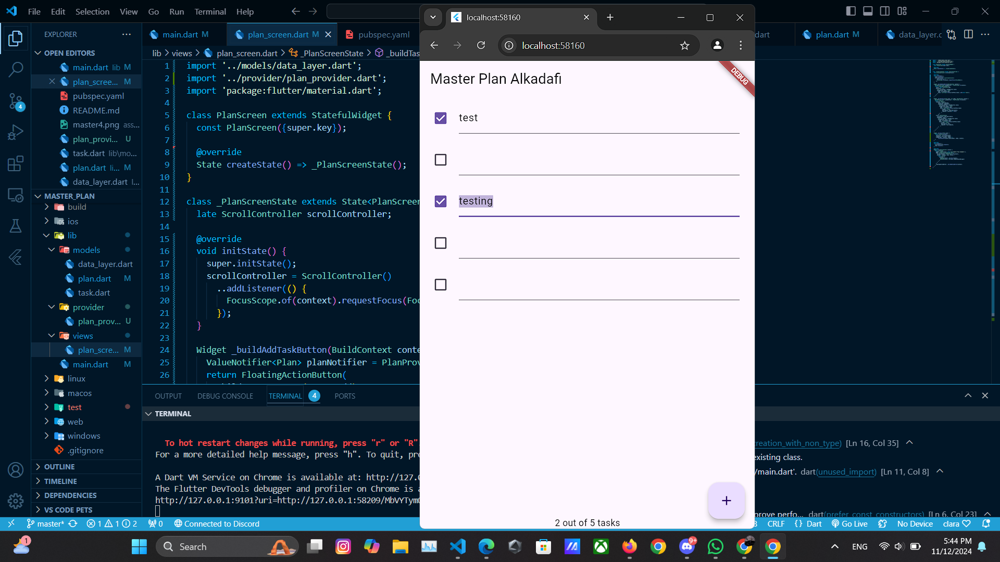

# master_plan

# Alkadafi Firnawan
# 362358302108

# Tugas Praktikum 1: Dasar State dengan Model-View

1. Selesaikan langkah-langkah praktikum tersebut, lalu dokumentasikan berupa GIF hasil 
akhir praktikum beserta penjelasannya di file README.md! Jika Anda menemukan ada 
yang error atau tidak berjalan dengan baik, silakan diperbaiki. 

2. Jelaskan maksud dari langkah 4 pada praktikum tersebut! Mengapa dilakukan demikian? 
- Hal ini dilakukan untuk memudahkan pengelolaan dan pengorganisasian kode seiring aplikasi berkembang. Dengan adanya file data_layer.dart, kita bisa mengekspor kedua model ini dalam satu tempat, sehingga file lain yang membutuhkan akses ke model Task atau Plan hanya perlu mengimpor data_layer.dart.

3. Mengapa perlu variabel plan di langkah 6 pada praktikum tersebut? Mengapa dibuat konstanta ? 
- variabel plan dalam class _PlanScreenState bertujuan untuk menyimpan state dari rencana yang akan ditampilkan dalam aplikasi. Variabel ini berfungsi untuk menyimpan objek Plan yang berisi nama dan daftar tugas (tasks).

4. Lakukan capture hasil dari Langkah 9 berupa GIF, kemudian jelaskan apa yang telah anda buat! 

- 

Langkah 9 membuat widget _buildTaskTile yang bertujuan untuk menampilkan setiap tugas di dalam plan.tasks sebagai ListTile. ListTile ini mencakup Checkbox dan TextFormField.

Checkbox: Checkbox memungkinkan pengguna untuk menandai status tugas sebagai "selesai" atau "belum selesai." Ketika checkbox ditekan, nilai complete pada task tersebut diperbarui melalui setState, sehingga tampilan akan merefleksikan perubahan status tugas tersebut. Dengan kata lain, ketika pengguna memilih checkbox, aplikasi akan menyimpan status terbaru dari tugas.

TextFormField: TextFormField memungkinkan pengguna untuk mengedit deskripsi tugas secara langsung di dalam daftar. Ketika pengguna mengetik sesuatu dalam field ini, nilai description dari task tersebut akan diperbarui dan disimpan dalam variabel plan.tasks. Penggunaan setState di sini sangat penting untuk memastikan bahwa perubahan teks dalam TextFormField ditampilkan secara langsung pada UI.

5. Apa kegunaan method pada Langkah 11 dan 13 dalam lifecyle state ? 
- Langkah 11 (initState - Menambahkan Scroll Listener)
ScrollController diinisialisasi pada initState dan ditambahkan listener untuk mendeteksi scroll. Saat pengguna menggulir layar, listener ini otomatis menghapus fokus dari TextField, yang berarti keyboard akan menutup jika masih terbuka. Ini sangat membantu, terutama di iOS, agar keyboard tidak menutupi TextField yang ada di bagian bawah layar dan memudahkan pengguna mengisi tugas dengan nyaman.

Langkah 13 (dispose - Melepaskan Scroll Controller)
dispose() berfungsi untuk melepaskan scrollController dari memori ketika halaman tidak lagi digunakan. Hal ini mencegah kebocoran memori yang bisa memperlambat aplikasi. Dengan melepaskan resource yang sudah tidak diperlukan, aplikasi bisa berjalan lebih efisien dan responsif.

# Praktikum 2

Hasil

# Jelaskan mana yang dimaksud InheritedWidget pada langkah 1 tersebut! Mengapa yang digunakan InheritedNotifier?
- InheritedWidget yang dimaksud pada langkah 1 adalah PlanProvider. Dengan turunan InheritedWidget ini, PlanProvider memungkinkan data Plan tersedia di seluruh widget subtree secara otomatis, tanpa harus mengirimkan data Plan ke setiap widget secara manual.
- Mengapa menggunakan InheritedNotifier?
InheritedNotifier adalah turunan InheritedWidget yang memungkinkan data Plan dalam ValueNotifier otomatis diperbarui di seluruh widget subtree saat ada perubahan, tanpa perlu panggilan setState.

# Jelaskan maksud dari method di langkah 3 pada praktikum tersebut! Mengapa dilakukan demikian?
- Pada langkah 3, kita menambahkan dua method (completedCount dan completenessMessage) ke dalam model Plan.
completedCount : Method ini menghitung berapa banyak Task di dalam daftar tasks yang sudah selesai (task.complete == true). Method ini menggunakan .where() untuk memfilter hanya tugas-tugas yang complete, lalu .length untuk menghitung jumlahnya
- completenessMessage : Method ini mengembalikan pesan yang menyatakan kemajuan (progress) dalam bentuk string, misalnya "2 out of 5 tasks." String ini menunjukkan jumlah tugas yang sudah selesai (completedCount) dari total jumlah tugas (tasks.length).

# Lakukan capture hasil dari Langkah 9 berupa GIF, kemudian jelaskan apa yang telah Anda buat!
- Penambahan SafeArea, SafeArea menampilkan completenessMessage dari Plan di bagian bawah layar, menghindari area yang terhalang UI (seperti notch atau navigation bar)

